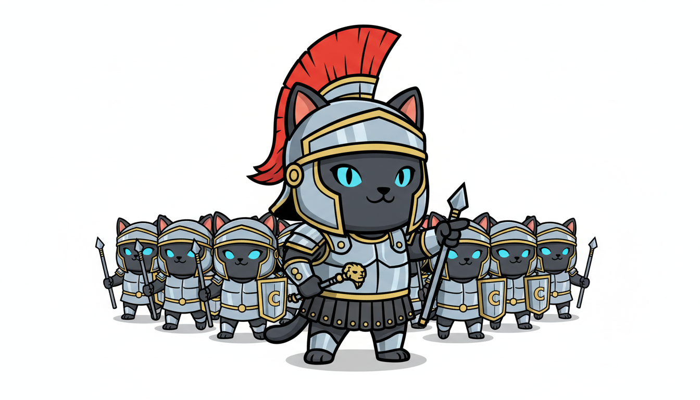
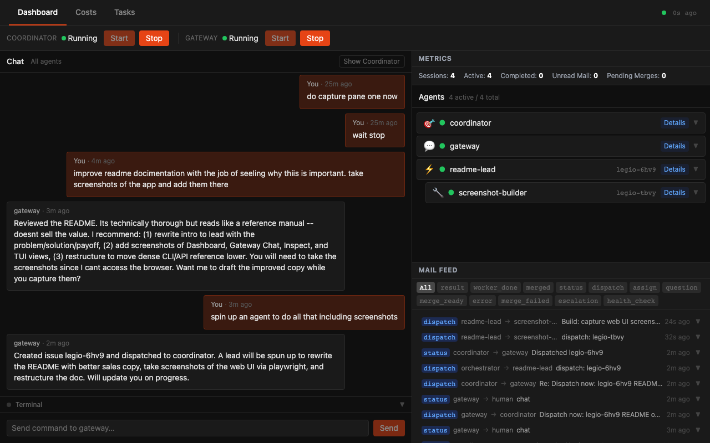
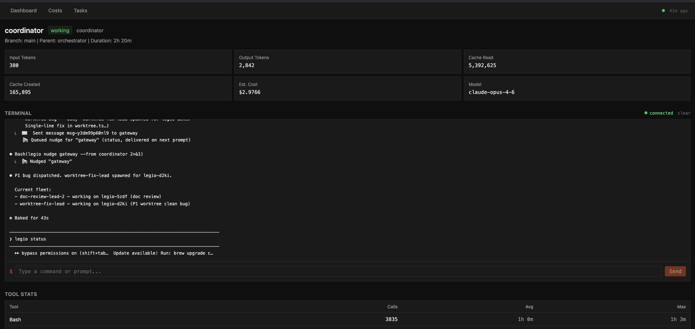
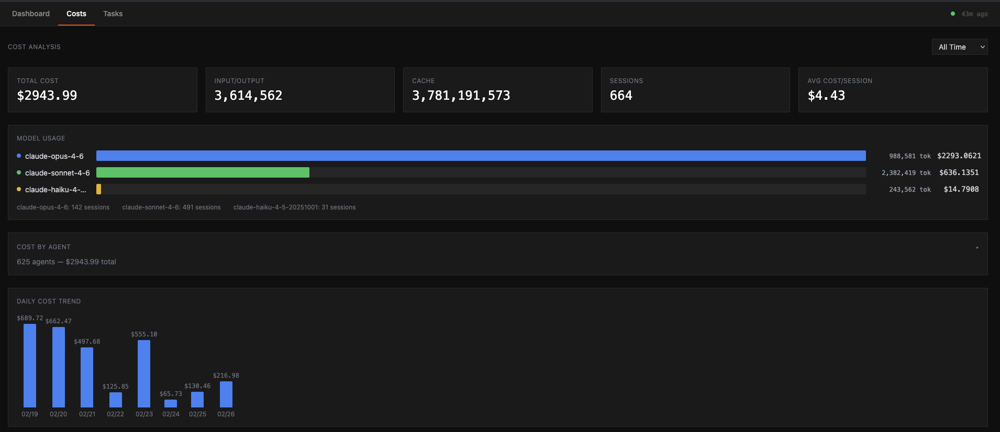
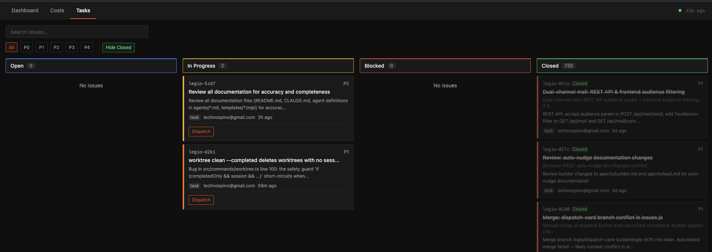

# Legio

<p align="center">
  
</p>

[](https://www.npmjs.com/package/@katyella/legio)
[](https://github.com/katyella/legio/actions/workflows/ci.yml)
[](https://opensource.org/licenses/MIT)
[](https://nodejs.org)
[](https://github.com/katyella/legio/releases)

**Turn one Claude Code session into a multi-agent fleet.**

Claude Code is powerful — but it works one task at a time. One agent, one context window, one thread of execution.

Legio changes that. It spawns specialized agents in isolated git worktrees, coordinates them through a typed SQLite messaging system, and merges their work back automatically. Your session becomes the orchestrator. The agents do the work in parallel.

- **Parallel execution** — 5-10 agents working simultaneously, each in its own tmux session
- **Conflict-free isolation** — every agent in its own git worktree with exclusive file ownership
- **Structured coordination** — typed SQLite mail system with protocol-level message types, not ad-hoc prompts
- **Automatic merge pipeline** — FIFO queue with 4-tier conflict resolution
- **Real-time visibility** — browser dashboard shows every agent's status, cost, and output live
- **Tiered health monitoring** — mechanical watchdog catches stalls and crashes before you do

> **Heads up:** Multi-agent swarms burn through tokens fast — a single session can push the limits of a 20x Max Claude subscription.

## See It in Action

<p align="center">
  
  <br>
  <em>Dashboard: live view of agent status, mail feed, merge queue, and system metrics</em>
</p>

<p align="center">
  
  <br>
  <em>Inspect: deep dive into any agent's activity, tool calls, and terminal output</em>
</p>

<p align="center">
  
  <br>
  <em>Costs: token usage by model, per-agent breakdown, and daily cost trends</em>
</p>

<p align="center">
  
  <br>
  <em>Tasks: kanban board with issue tracking, priority filters, and dispatch controls</em>
</p>

## Quick Start

```bash
cd your-project

# Bootstrap everything — init, start server, open browser
legio up

# Verify setup is healthy
legio doctor

# When you're done, shut it all down
legio down
```

## How It Works

CLAUDE.md + hooks + the `legio` CLI turn your Claude Code session into a multi-agent orchestrator. A persistent coordinator manages task decomposition and dispatch, while a mechanical watchdog daemon monitors agent health.

```
Coordinator (persistent orchestrator at project root)
  --> Lead (team lead, decomposes tasks, depth 1)
        --> Workers: Scout, Builder, Reviewer, Merger (depth 2)
```

**Agent types:** Coordinator, Lead, Gateway, Supervisor, Scout, Builder, Reviewer, Merger, Monitor, CTO — each with defined access levels (read-only vs read-write) and hierarchy constraints. See [docs/architecture.md](docs/architecture.md) for details.

## Key Features

- **Messaging system** — SQLite-backed typed mail with protocol messages (`worker_done`, `merge_ready`, `dispatch`, `escalation`), broadcast groups (`@all`, `@builders`), and auto-nudge on high priority
- **Merge pipeline** — FIFO queue with 4-tier conflict resolution, from fast-forward through AI-assisted merge
- **Web dashboard** — Real-time agent monitoring, mail feed, cost tracking, terminal access, and setup wizard via browser UI (Preact + HTM, zero build step)
- **Health monitoring** — Tier 0 mechanical daemon (tmux/pid liveness), Tier 1 AI-assisted failure triage, Tier 2 continuous monitor agent
- **Tool enforcement** — PreToolUse hooks mechanically block dangerous operations per agent role
- **Task groups** — Batch coordination with auto-close when all member issues complete
- **Session lifecycle** — Checkpoint save/restore for compaction survivability, crash recovery handoffs

## Installation

```bash
npm install -g @katyella/legio
```

### From Source

```bash
git clone https://github.com/katyella/legio.git
cd legio
npm install
npm link
```

## Requirements

- [Node.js](https://nodejs.org) (v22+)
- [Claude Code](https://docs.anthropic.com/en/docs/claude-code)
- git
- tmux
- [bd (beads)](https://github.com/jayminwest/beads) — issue tracking CLI
- [mulch](https://github.com/jayminwest/mulch) — structured expertise management CLI

## Documentation

- [CLI Reference](docs/cli.md) — full command reference with all flags
- [REST API](docs/api.md) — server endpoints and WebSocket
- [Architecture](docs/architecture.md) — tech stack, agent types, project structure

## Development

```bash
npm test && npm run lint && npm run typecheck
```

## License

MIT

---

Adopted from [Overstory](https://github.com/jayminwest/overstory).

